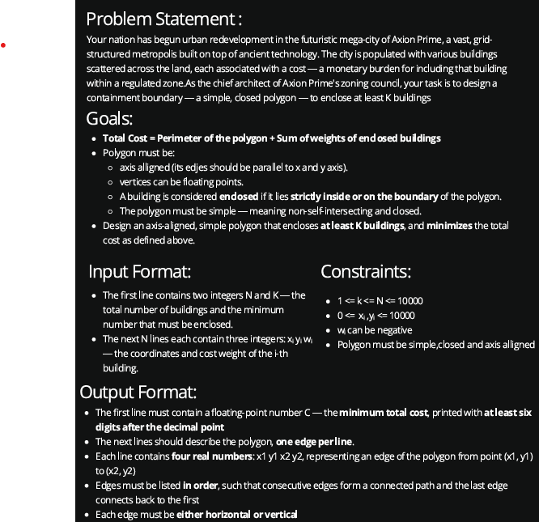
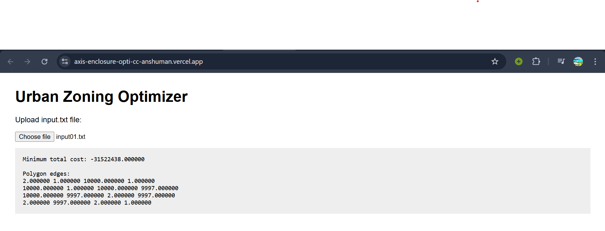

<h1 align="center" id="title">AXIS-ALIGNED ENCLOSURE OPTIMIZATION PROJECT- CODING CLUB(IITG)</h1>

<div align="center">
  
</div>


<p id="description">Optimal heuristic-based solver for enclosing at least K zones/buildings with an axis-aligned rectangle of minimum total cost (penalty + perimeter). Designed for large-scale zoning optimization in grid-based environments.</p>
<p align="center">
  
</p>

<h2>🚀 Demo</h2>

[https://axis-enclosure-opti-cc-anshuman.vercel.app/](https://axis-enclosure-opti-cc-anshuman.vercel.app/)

📁 Project Structure

1. OUTPUT - Output files for all the sample inputs being used to test the algo.

2. TestCases/inputxx.txt – Sample input file for testing.

3. README.md – Documentation and usage guide for the project.

4. index.html – Web interface for uploading input files and viewing output.

5. zoningoptimiser.cpp – Core C++ logic that solves the Axis-Aligned Enclosure Optimization problem.

###  Compile the C++ Code

To compile the `zoningoptimiser.cpp` file:

```bash
g++ -std=c++17 -O2 zoningoptimiser.cpp -o zoningoptimiser
```

<h2>🛡️ License:</h2>

This project is licensed under the MIT License

<h2>💖Like our work?</h2>

For any queries on how to test/use contact anshuman.mondal@iitg.ac.in , b.ishaan@iitg.ac.in


